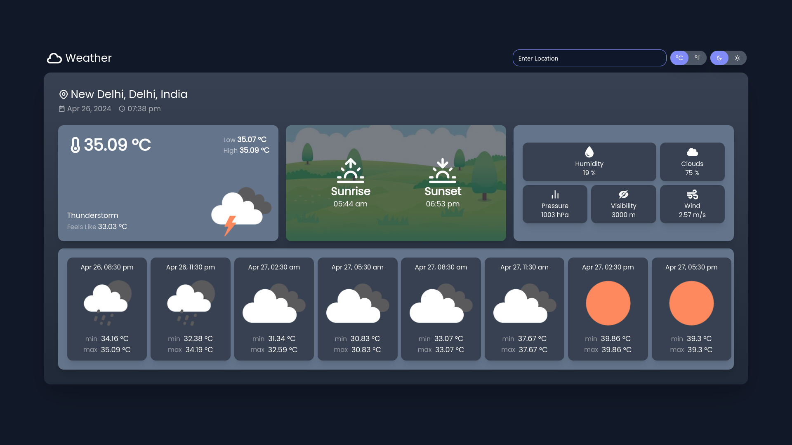
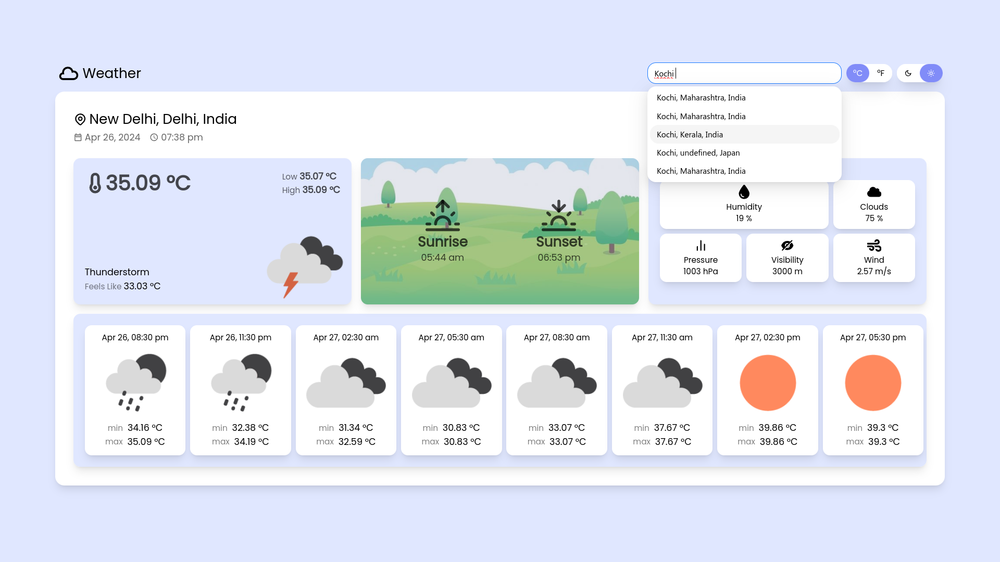
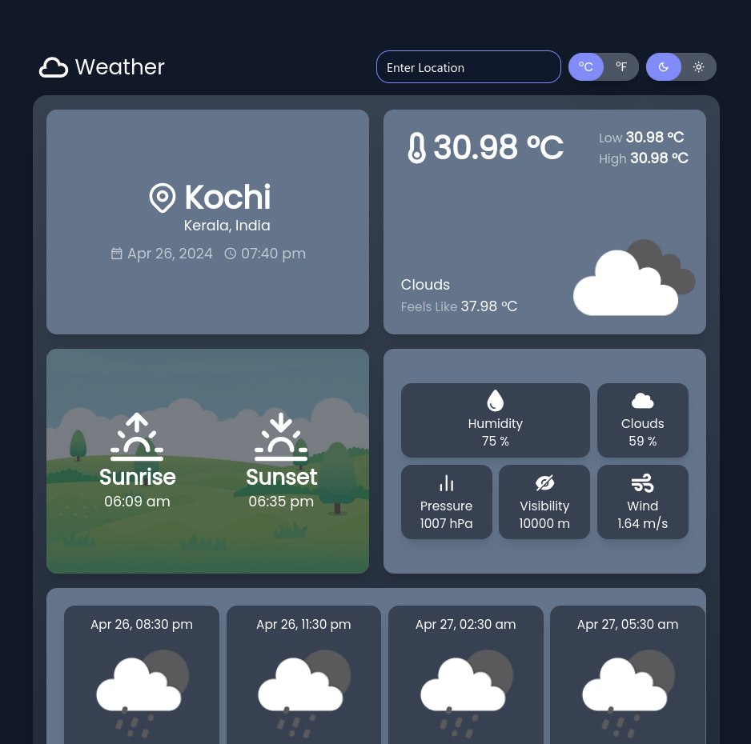
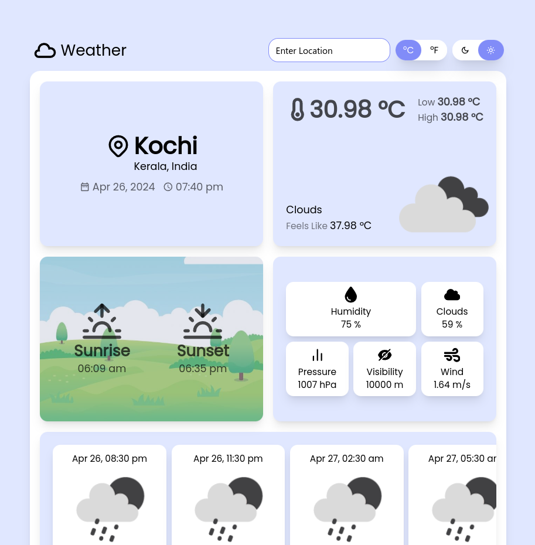
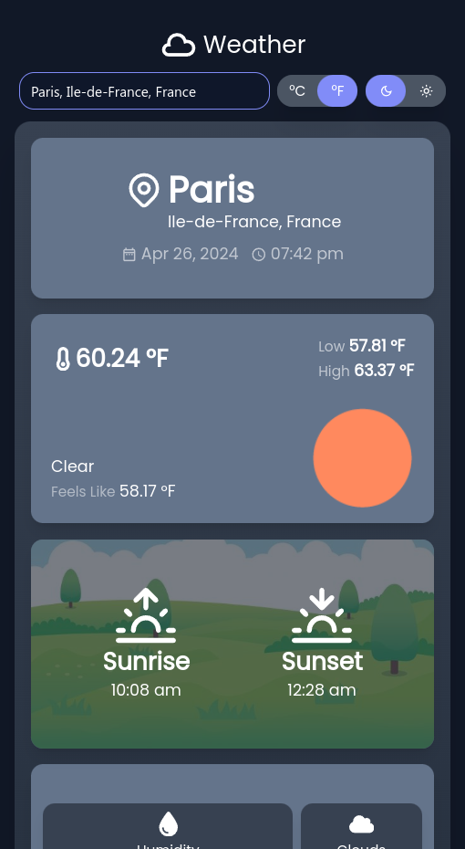
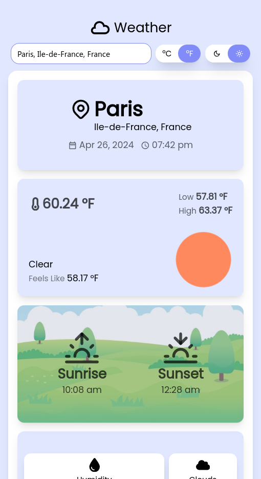

# Weather App
<div style="display:flex; flex-direction:column">
    <div style="font-size:22px">The most Beautiful Weather App</div>
    <div style="font-size:16px">(Made using React.js, Tailwind CSS and Ant Design)</div>
    <div style="margin-top:20px; display:flex; flex-direction:column">
        <span style="font-size:22px">APIs used:</span>
        <a href="https://openweathermap.org/api">https://openweathermap.org/api</a>
        <a href="https://www.geoapify.com/geocoding-api">https://www.geoapify.com/geocoding-api</a>
    </div>
</div> 

## To run locally (must have Node.js and NPM installed)
1. Clone this project on your local device & install necessary packages
```
git clone 'https://github.com/harshpx/weather.git'
cd weather
npm i
```
2. Get your 'Openweather' and 'Geoapify' API keys, then create '.env' file & add your API keys there.
```
#inside .env file

VITE_GEOCODING_API_KEY=""
VITE_OPENWEATHER_API_KEY=""
```
3. Run the App
```
npm run dev
```

## Features
* Most beautiful UI that I've ever made
* Dark and Light modes
* Responsive UI (looks good on all screen sizes)
* Celsius and Fahrenheit Units
* 5 Day Weather forecast 
* Efficient API handeling
* Industry standard code structure

## Screenshots
<div style="display:flex; flex-direction:column; gap:30px">
    <div style="display:flex; flex-direction:column; gap:10px">
        <span style="font-size:18px;">Desktops</span>
        
        
    </div>
    <div style="display:flex; flex-direction:column; gap:10px">
        <span style="font-size:18px;">Tablets</span>
        
        
    </div>
    <div style="display:flex; flex-direction:column; gap:10px">
        <span style="font-size:18px;">Mobiles</span>
        <div style="display:flex; gap:10px">
            
            
        </div>
    </div>
</div>